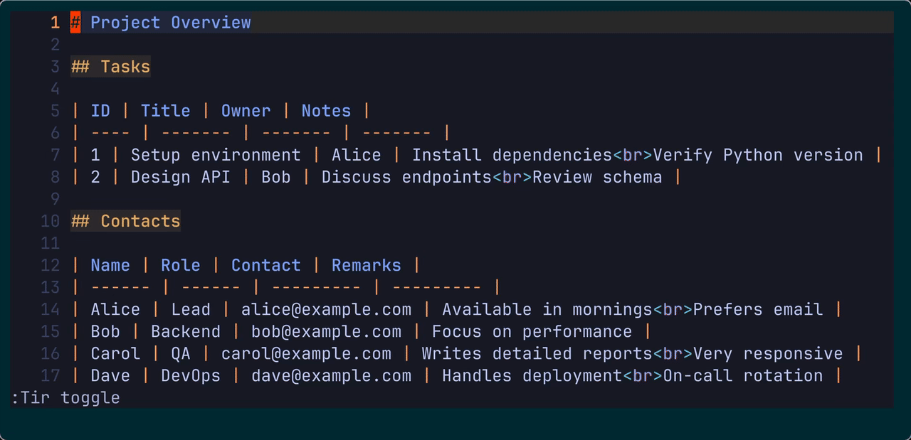

# tirenvi.nvim

[](https://github.com/kibi2/tirenvi.nvim/actions)
[](https://codecov.io/gh/kibi2/tirenvi.nvim)

[](https://opensource.org/licenses/MIT)


> Structural table editing for Neovim — pure text, always valid.



Raw Markdown → structured table view → adjust column widths → edit cells → back to raw Markdown (lossless round-trip)

## Design Philosophy

* Vim-first
* Text-only buffer
* Structurally safe
* Fully reversible transformation
* No hidden metadata
* Always valid

## Why?

CSV and Markdown are text.

But they also represent structure.

Tirenvi lets you edit structured tabular data
without leaving Vim’s native editing model —
while preserving structural integrity.

You edit text.
Tirenvi preserves structure.

## Core Architecture

At the center is: **TIR — Tabular Intermediate Representation**

```text
flat (gfm markdown, csv, tsv, ...)
        ↓ external parser
TIR (intermediate representation)
        ↓ tirenvi
tir-vim (structured buffer view)
```

Editing happens in **tir-vim format**.

On save:

```text
tir-vim → TIR → original flat format
```

Key principles:

* The buffer contains only text
* No hidden state
* No shadow buffer
* No custom buffer type
* Transformations are reversible
* The buffer is always structurally valid

Edit tables directly in Vim — without breaking structure.

## Features

* Render CSV/TSV/GFM into an aligned structured view
* Preserve original file format on save
* Toggle raw ↔ structured view
* Automatic structural correction
* Multiline cell support with preserved line breaks
* Column width control with wrapping support
* Grid-aware join that preserves column structure
* Column text objects for structural editing
* Works with all native Vim motions and operators
* External parser architecture (extensible)
* No learning curve

## Structural Integrity Model

Tirenvi is a **strict editor**.

* Invalid structural edits are detected
* In Normal mode: corrected immediately
* In Insert mode: corrected after leaving Insert
* Undo tree integrity is preserved
* Only leaf undo states are auto-corrected

Structural integrity is preserved in the current editing state.

Tirenvi respects Vim’s undo tree.
Historical undo states are not modified,
even if they contain temporary structural inconsistencies.

## Installation

### lazy.nvim

```lua
{
  "kibi2/tirenvi.nvim",
  dependencies = {
    "tpope/vim-repeat", -- optional: enables '.' repeat for column width operations
  },
  config = function()
    require("tirenvi").setup()
  end,
}
```

### vim-plug

```vim
Plug 'kibi2/tirenvi.nvim'

" Optional: enables '.' repeat for column width operations
Plug 'tpope/vim-repeat'
```

### Requirements

* Neovim >= 0.9
* UTF-8 environment

Install parsers:

```bash
pip install tir-gfm-lite
pip install tir-csv
pip install tir-pukiwiki
```

## Usage

Automatically activates based on filetype (via parser_map):

* `csv`
* `tsv`
* `markdown`
* `pukiwiki`

Custom parser mapping:

```lua
require("tirenvi").setup({
  parser_map = {
    csv = { executable = "tir-csv", required_version = "0.1.4" },
    tsv = { executable = "tir-csv", options = { "--delimiter", "\t" }, required_version = "0.1.4" },
    markdown = { executable = "tir-gfm-lite", allow_plain = true, required_version = "0.1.5" },
    pukiwiki = { executable = "tir-pukiwiki", allow_plain = true, required_version = "0.1.1" },
  }
})
```

## Commands

| Command | Description |
| ------------- | ---------------------------------- |
| `:Tir redraw` | Recalculate column widths |
| `:Tir toggle` | Switch raw ↔ structured table view |
| `:Tir width[=+-][count]` | Adjust column width by count (`=`: set, `+/-`: increment/decrement) |

All native Vim editing works.

* `dd`, `yy`, `p`, `D`, `o`, `R`, `J`, and more
* Command-line command
* Visual mode command

No special editing mode.

## Column Editing

Columns are structural units.

To modify a column:

1. Select a column using text objects (`vil`, `val`, `v3al`)
2. Apply standard operators (`d`, `p`, etc.)

```lua
require("tirenvi").setup({
  textobj = {
    column = "l",
  },
})
```

Operations that would break structure
are automatically corrected.

Column width operations support `.` repeat when
[`vim-repeat`](https://github.com/tpope/vim-repeat) is installed.

## Pipe Motions

Fast horizontal navigation across cells.

```lua
vim.keymap.set({ 'n', 'o', 'x' }, '<leader>tf', require('tirenvi').motion.f, { expr = true })
vim.keymap.set({ 'n', 'o', 'x' }, '<leader>tF', require('tirenvi').motion.F, { expr = true })
vim.keymap.set({ 'n', 'o', 'x' }, '<leader>tt', require('tirenvi').motion.t, { expr = true })
vim.keymap.set({ 'n', 'o', 'x' }, '<leader>tT', require('tirenvi').motion.T, { expr = true })
```

They behave like Vim’s `f/F/t/T`,
but target table separators.

`;` and `,` continue to repeat as usual.

Note: There are two types of pipes (continuation and non-continuation),
so motions may behave differently across lines.

## What Tirenvi Is Not

* Not a spreadsheet
* Not a new editing mode
* Not a hidden AST editor
* Not a file-format converter

It is a structured text editor layer.

## Roadmap

### In Progress

* Text objects (table, row, column, cell)

### Planned

* Column formatting presets
* Outline mode
* Optional non-strict mode (experimental)

## Comparison

| Feature | Tirenvi | csv.vim | Spreadsheet tools |
| ------------------------- | ------- | ------- | ----------------- |
| Native Vim editing | ✅ | ⚠️ | ❌ |
| Always structurally valid | ✅ | ❌ | ⚠️ |
| No file format change | ✅ | ❌ | ❌ |
| No custom buffer type | ✅ | ❌ | ❌ |
| Toggle raw view | ✅ | ❌ | ❌ |
| Markdown | ✅ | ❌ | ❌ |
| Automatic wrapping | ✅ | ❌ | ⚠️ |
| Grid-aware join | ✅ | ❌ | ❌ |

Tirenvi prioritizes **structural safety with Vim purity**.

## Contributing

The architecture centers around:

* flat ↔ TIR (external)
* TIR ↔ tir-vim (internal)

Large changes should respect this separation.

Please open an issue before major design proposals.

## License

MIT License.
